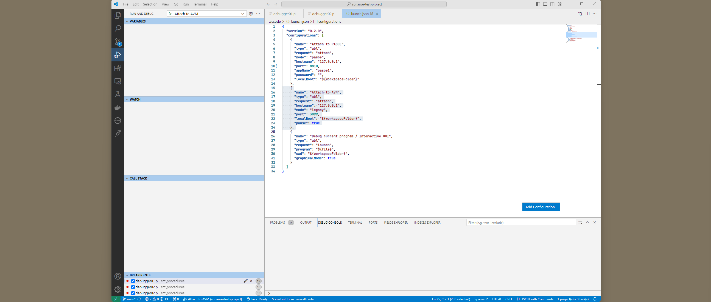
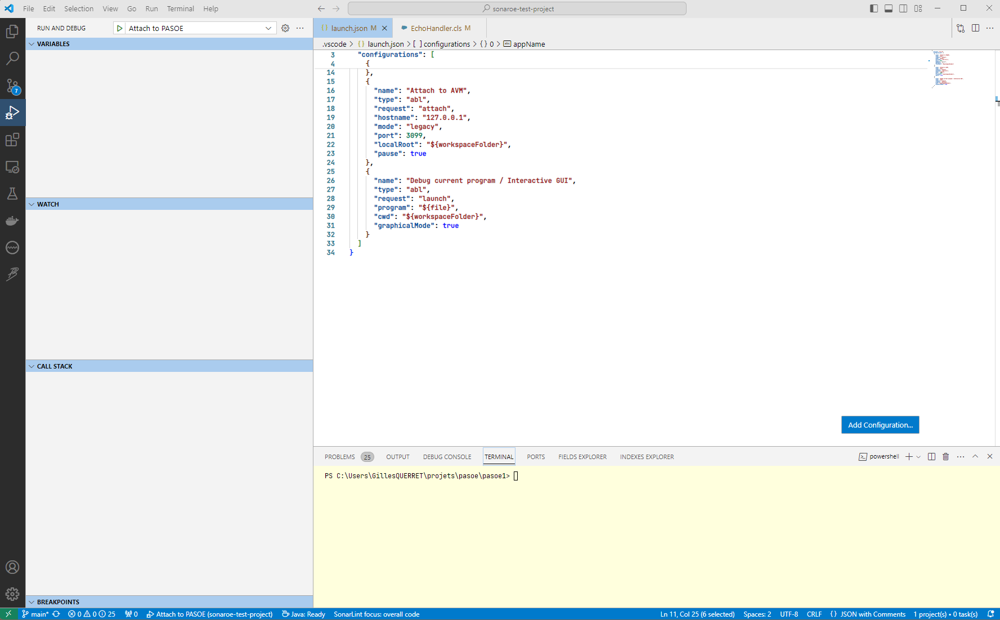
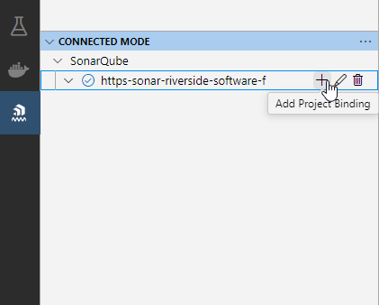
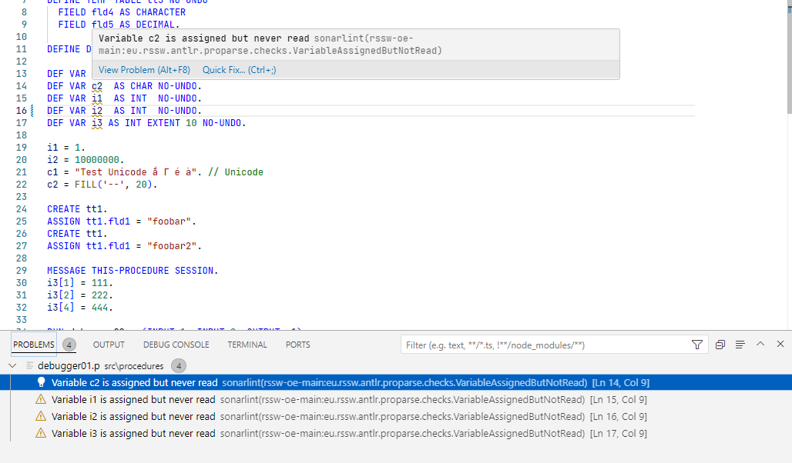

# OpenEdge ABL support for Visual Studio Code
This extension provides rich OpenEdge ABL support for Visual Studio Code - [Extension page](https://marketplace.visualstudio.com/items?itemName=RiversideSoftware.openedge-abl-lsp)

## Current Status
This extension is based on the existing Christophe Camicas work, but went through a complete overhaul due to the addition of the Language Server. This extension is actively maintained, so unless you don't want to switch to the new configuration files, you should use this extension.

## Features
* Syntax highlight
* OpenEdge project configuration (propath, database connections, aliases, ...)
* Multi-thread background compiler
* Profiles
* Debugger (legacy and PASOE)
* Code completion

## Requirements
This extension requires at least one OpenEdge installation, with a developer license. The extension is currently tested with 11.7, 12.2 and 12.8. It may or may not work with older versions.

## Global Configuration
OpenEdge runtimes have to be declared in VSCode configuration file. Open settings `(Ctrl + comma)` -> Extensions -> ABL Configuration -> Runtimes, or modify `settings.json`:

```jsonc
    "abl.configuration.runtimes.default": "12.8", // Default ABL version
    "abl.configuration.runtimes": [
        {
            "name": "12.8",
            "path": "C:\\Progress\\Openedge-12.8"
        },
        {
            "name": "12.2",
            "path": "C:\\Progress\\Openedge-12.2"
        },
        {
            "name": "11.7",
            "path": "C:\\Progress\\OpenEdge-11.7"
        }
    ],
```

## Project Configuration
OpenEdge projects can be configured in a file called `openedge-project.json`. This file has to be in the root directory of the project.
```jsonc
{
  "name": "MyProject", // Project name, will be used in the future for dependency management
  "version": "1.0",    // Project version number, will be used in the future for dependency management
  "oeversion": "12.8", // Must reference an existing ABL version in Settings -> Extensions -> ABL Configuration -> Runtimes
  "graphicalMode": true, // True for prowin[32], false for _progres
  "charset": "utf-8",  // Charset
  "extraParameters": "", // Extra Progress command line parameters
  "sonarlintProperties": { // Extra sonarlint properties.
    // "sonar.oe.preprocessor.process-architecture": "32",
    // "sonar.oe.proparse.tokenStartChars": "!"
  },
  "buildPath": [
    // Entries can have type 'source' or 'propath'. Path attribute is mandatory. Build attribute is optional (defaults to 'path'). Xref attribute is optional (defaults to 'build/.pct' or '.builder/srcX')
    { "type": "source", "path": "src/procedures" },
    { "type": "source", "path": "src/classes" },
    { "type": "source", "path": "src/dev", "includes": "foo/**,bar/**", "excludes": "foo/something/**" },
    { "type": "propath", "path": "${DLC}/tty/netlib/OpenEdge.net.pl", "documentation": "openedge.json" }
  ],
  "buildDirectory": "build", // Optional global build directory
  "dbConnections": [ // Unlimited number of connections - Beware of -h
    {
      "name": "sp2k", // Logical name of database, or physical name if -ld is not used
      "connect": "-db db/sp2k -RO", // ABL connection string
      "schemaFile": "dump/sp2k.df",   // Database schema, DF format
      "aliases": [ "foo", "bar"]    // List of aliases in ABL session
    }
  ],
  "numThreads": 1, // Number of OpenEdge sessions handling build
  "procedures": [
    // List of procedures executed before the main entry point
    // Init mode -> before setting propath and DB connections
    // Once, persistent and super -> after setting propath and DB connections
    { "name": "foo/bar.p", "mode": "once" /* Mode can be init, once, persistent or super */ }
  ],
  "profiles": [ /* See section below */ ]
}
```

You can also create the openedge-project.json file from an ABL session (PDSOE or plain prowin/_progres) by executing [this procedure](https://github.com/cverbiest/pct-utils/blob/master/src/vscode/generate_riverside_vscodeconfig.p) (provided by [Carl Verbiest](https://github.com/cverbiest)).

## Activation
The extension is activated when a `.p`, `.w` or `.cls` file is opened. ABL actions may fail before the extension is activated.

## Actions & Keyboard Shortcuts
The following actions are defined in this extension (use Ctrl + Shift + P to execute actions):
* Restart ABL Language Server: restart the background Java process (and OpenEdge sessions)
* Rebuild project: delete all rcode and recompile all files
* Open File in AppBuilder: start the AppBuilder (with DB connections and propath) and open current file
* Open Data Dictionary
* Run with Prowin: execute current file in prowin[32] session
* Run with _progres in batch mode: execute current file in _progres session (with `-b`)
* Run with _progres: execute current file (with _progres) in Terminal view
* Switch to profile: switch current project to another profile
* Fix casing of source code: convert all keywords to uppercase or lowercase

The following keyboard shortcuts are configured by default:
* F2: Run current file (in batch mode with _progres)
* Shift + F8: Open current file in AppBuilder

## Extra Profiles
On top of the default profile configured in `openedge-project.json`, additional profiles can be configured in the `profiles` section. Each profile is defined by a name, parent's name (optional) and a set of values. For example:
```jsonc
{
  /* Default profile values */
  "version": "12.8", "graphicalMode": false, "dbConnections": "-db db/sp2kv12 -RO",
  "profiles": [
    { "name": "V11", "inherits": "default", "value": { "oeversion": "11.7", "dbConnections": "-db db/sp2kv11 -RO" } },
    { "name": "V12.2 GUI", "value": { "oeversion": "12.2", "graphicalMode": true }}
  ]
}
```
V11 Profile inherits from the default profile, so graphicalMode will be set to true. OpenEdge version and DB connections are specified in the profile.
V12.2 GUI Profile doesn't inherit from the default profile, so it won't have any DB connection.
When opening a project, VSCode will check for `.vscode/profile.json`. If this file is present, then this profile will be loaded. Otherwise, the default profile will be used. It is recommended to add this file to the SCM ignore list.

## Debugger

You can use the debugger to debug a remote ABL session (assuming it is started with -debugReady) or PASOE instance (assuming that oedebugger webapp is deployed).

The debugger supports those features:
- step over, step into, step out, continue, suspend
- breakpoints
- display stack
- display variables (including arrays and objects), temp-tables, buffers, parameters and datasets
- watch / evaluate basic expressions (currently disabled)
- jumping in and out of include files

You first need to create the launch configuration in your `.vscode/launch.json` file ; use `Ctrl + Shift + D` to open the "Run and Debug" view, then click on "Add Configuration" and select one of the ABL options.

```json
{
  "version": "0.2.0",
  "configurations": [
    {
      "name": "Attach to AVM",
      "type": "abl",
      "request": "attach",
      "hostname": "127.0.0.1",
      "mode": "legacy",
      "port": 3099,
      "pause": true,
      "localRoot": "${workspaceFolder}"
    }
  ]
}
```

To attach to a remote process, it needs to be [debug-ready](https://docs.progress.com/bundle/openedge-classic-appserver-development-117/page/Attaching-the-Debugger-to-an-AppServer-session.html). The easiest way to achieve that is to add `-debugReady 3099` to the startup parameters (`.pf` file) of your application server.
When debugging a local procedure, VSCode will always start the AVM session with `-debugReady 9999`, so it won't be possible to start two debug sessions at the same time. This limitation will *probably* be lifted in the future. The debugger will also stop at the first instruction, which is always a VSCode specific procedure. You can immediately type `F5` to jump to the first executable line of *your* procedure.


[Full size image](https://raw.githubusercontent.com/vscode-abl/vscode-abl/main/resources/images/debugger01.webp)


[Full size image](https://raw.githubusercontent.com/vscode-abl/vscode-abl/main/resources/images/debugger02.webp)

## Code Analysis in VSCode

[CABL](https://wiki.rssw.eu/cabl/Home.md) (Code analysis for ABL) is now available as a separate [VS Code extension](https://github.com/Riverside-Software/sonarlint-vscode/releases/latest). It is currently **not** available on the VS Code marketplace, the extension has to be downloaded from its GitHub repository, and installed with "Extensions: Install from VSIX..." command (type `Ctrl` + `Shift` + `P`, then `vsix`).

SonarLint CABL requires Java 17 to be executed. If Java 17 is not available in your PATH, you can configure it in the VS Code settings:


Once configured and initialized, configure the connection to your SonarQube server. Open the "SonarLint CABL" view, and click on the "Add SonarQube Connection" button. Note that SonarCloud connection is not supported with ABL (and will never be supported).


Then bind your local project to a remote SonarQube project by clicking on the "Add Project Binding" button:



Select the remote project:


Check that binding is present in SonarLint CABL view:


CABL rules will now be executed when any ABL file is saved in VS Code:




## Unit tests

** Unit tests are currently inactive **

Based upon the ABLUnit framework (need to be installed locally), you can specify launch parameters to find and execute test files
```json
{
    "test": {
        "files":[
            "tests/*.test.p"
        ],
        "beforeEach": {
            "cmd": "%ProgramFiles%\\Git\\bin\\sh.exe",
            "args": [
                "-c",
                "echo starting"
            ]
        },
        "afterEach": {
            "cmd": "%ProgramFiles%\\Git\\bin\\sh.exe",
            "args": [
                "-c",
                "echo done"
            ]
        }
    }
}
```

## Configuration checklist

Here are a few things to verify before opening [issues](https://github.com/vscode-abl/vscode-abl/issues/new):
* OpenEdge has to be installed on your local machine, and configured in VSCode. As of today, versions 11.7, 12.2 and 12.8 have been tested.
* Verify that the openedge-project.json is present in the root directory, and has no syntax error
* Make sure at least one .p or .cls is opened, as the extension is not active by default
* Check the Java command line being executed (using Process Explorer for example)
* Check the OE command line being executed (also using Process Explorer for example)
* Check the .builder directory in your project, it contains valuable log files
* Make sure you have `source` directories in your configuration file ; `propath` entries are not monitored and thus nothing would be recompiled
* Check the ABL Language Server output: open Output view (Ctrl + Shift + U) then ABL Language Server in the combo-box

## Greetings
Initial plugin development done by [chriscamicas](https://github.com/chriscamicas). In turn, largely inspired by ZaphyrVonGenevese work (https://github.com/ZaphyrVonGenevese/vscode-abl).
Also inspired by vscode-go and vscode-rust extensions.

Thanks to all the contributors: mscheblein, [Peter Judge](https://github.com/peterjudgeza)

## License
VSCode Plugin Code is licensed under the [MIT](LICENSE) License.
Language Server code is © Copyright Riverside Software.
